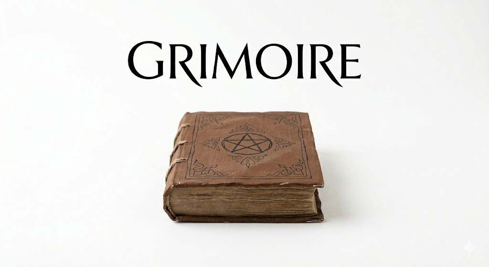

# Grimoire

<p align="center"></p>

A minimal novel-writing desktop app for Mac, built with Tauri v2 + React + TipTap + SQLite. Black/white design, Korean-first UI.

Register works, write episodes with a WYSIWYG markdown editor, and manage world-building notes with `/page` slash commands. Press `Shift+Tab` to reference notes while writing.

```bash
npm install && npm run tauri dev
```
